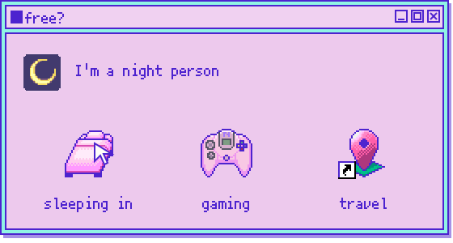
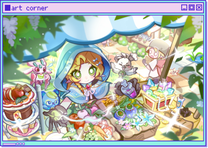
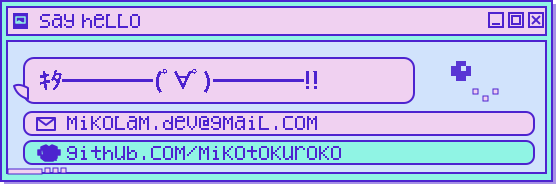

  

  <a href="#hey-im-lam">about me</a> &nbsp; / &nbsp;
  <a href="#after-hours">after hours</a> &nbsp; / &nbsp;
  <a href="#art-corner">art</a> &nbsp; / &nbsp;
  <a href="#say-hello">say hello</a>

 

### Hey, I'm lam ^^

**Studying** · Computer science @ University of Melbourne

**I speak** · Cantonese, English & Mandarin. 

**I type** · C# · Java · JavaScript · Python 

**Learning** · French, Swift, and bunch of random stuff

 

I’m into **game development, modding, plugins, and extensions**. I love my pets, including the desktop pets.
 

## After hours

### Very much a night person.

Sleeping in, staying up, and getting lost somewhere. Usually in a game; sometimes in a new city.

My free time has three competing priorities: **sleeping, gaming, and travelling**. The order is negotiable.

 
 

### Sometimes I play. Sometimes I mod.

I make mods for **Minecraft and Stardew Valley**, and I’ve also built a **Genshin roguelike DLC**.

In technical Minecraft, my favourite build is a **TNT-duper flying machine** |'ω')ﾉ⌒゜ &#x1F4A3; ﾎﾟｲｯ

**Made with** · Unity & C#

 

 

## Art corner

Meet **Elaria**, my original character. A little piece of the world in my head.

  

<em>More of her story, and more artwork, to come.</em>

 

## Say hello

<h3 align="center">Thanks for stopping by ♡  See you around.</h3>

  <a href="mailto:mikolam.dev@gmail.com">Send me a note ↗</a> &nbsp; · &nbsp;
  <a href="https://github.com/mikotokuroko">GitHub ↗</a>

 
 

A peek at my GitHub activity

  

Credits

The [media-player frame](assets/third-party/needy-streamer-window.png) comes from [Needy Streamer Overload](https://github.com/lezzthanthree/Needy-Streamer-Overload) (MIT). See the [asset attribution](assets/third-party/README.md).

