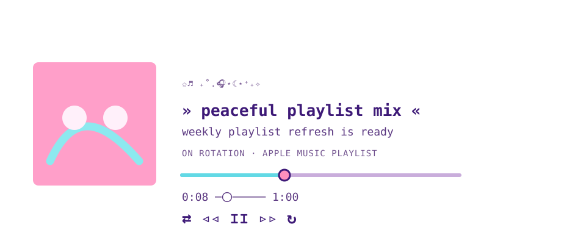
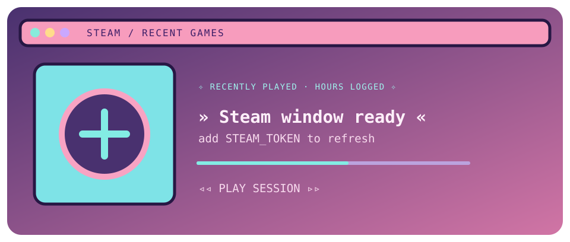

hoi — building playful tools for macOS, the web, and Codex.

Player frame: <a href="https://github.com/lezzthanthree/Needy-Streamer-Overload">Needy Streamer Overload</a> (MIT).

[**Apple Music Local**](https://github.com/mikotokuroko/apple-music-local-plugin) — control a personal Apple Music library from a local Codex session.

[**Ark Codex Deskpet**](https://github.com/mikotokuroko/Ark-codex-skill) — animated Arknights-inspired desktop pets for macOS.

[**Safari Dark Mode**](https://github.com/mikotokuroko/safari-dark-mode) — a focused dark-mode extension for Safari.

@mikotokuroko

