hoi — building playful tools for macOS, the web, and Codex.

### [Apple Music Local](https://github.com/mikotokuroko/apple-music-local-plugin)
Control a personal Apple Music library from a local Codex session.

### [Ark Codex Deskpet](https://github.com/mikotokuroko/Ark-codex-skill)
Animated Arknights-inspired desktop pets for macOS.

### [Safari Dark Mode](https://github.com/mikotokuroko/safari-dark-mode)
A focused dark-mode extension for Safari.

@mikotokuroko

