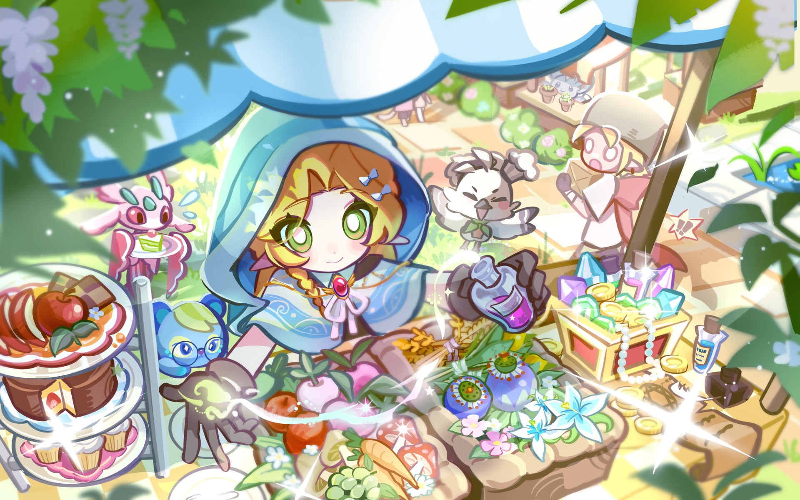

  

  

## Things I build

- [Apple Music Local](https://github.com/mikotokuroko/apple-music-local-plugin) — Control your Apple Music library from a local Codex session.
- [Ark Codex Deskpet](https://github.com/mikotokuroko/Ark-codex-skill) — Animated Arknights-inspired desktop pets for macOS.
- [Safari Dark Mode](https://github.com/mikotokuroko/safari-dark-mode) — A focused dark-mode extension for Safari.

## Off the clock

### On rotation

A weekly pick from my Apple Music playlist.

<!-- MUSIC:START -->
<!-- MUSIC:END -->

[Open my playlist](https://embed.music.apple.com/mo/playlist/peaceful/pl.u-MDAWWjguWLNb69v?l=en)

### Recently played

<!-- STEAM:START -->
<!-- STEAM:END -->

[My Steam profile](https://steamcommunity.com/profiles/76561199045338784)

## Art corner

  

A little artwork from my corner of the internet.

Credits

The retained [media-player frame](assets/third-party/needy-streamer-window.png), used in the former music card, comes from [Needy Streamer Overload](https://github.com/lezzthanthree/Needy-Streamer-Overload) (MIT). See the [asset attribution](assets/third-party/README.md).

