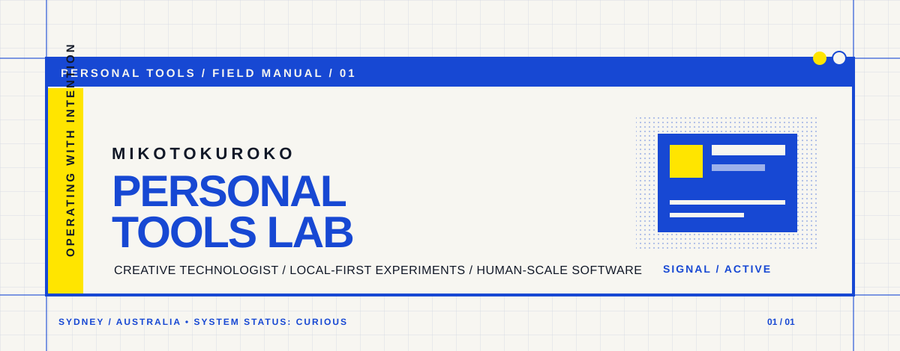

<picture>
  <source media="(prefers-color-scheme: dark)" srcset="assets/instrument-panel-dark.svg">
  <source media="(prefers-color-scheme: light)" srcset="assets/instrument-panel-light.svg">
  
</picture>

 

## About me

I build small personal tools that make everyday software more useful and enjoyable. I care about local-first design, clear controls, and thoughtful details.

## Featured projects

### [Apple Music Local Plugin](https://github.com/mikotokuroko/apple-music-local-plugin)

A Windows-only local Codex plugin for browsing and managing Apple Music through `applemusic-mcp`.

### [BMTI](https://github.com/mikotokuroko/BMTI)

A playful personality test made for friends.

## GitHub activity

<picture>
  <source media="(prefers-color-scheme: dark)" srcset="assets/field-signal.svg">
  <source media="(prefers-color-scheme: light)" srcset="assets/field-signal.svg">
  
</picture>

  Open to thoughtful collaborations and interesting problems.

